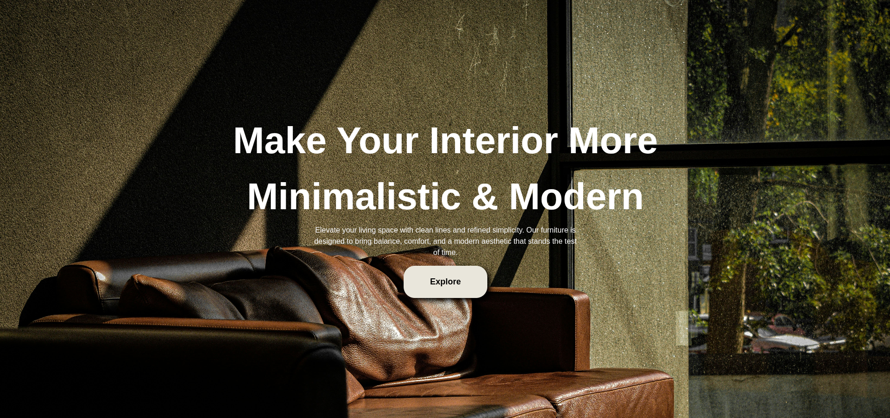
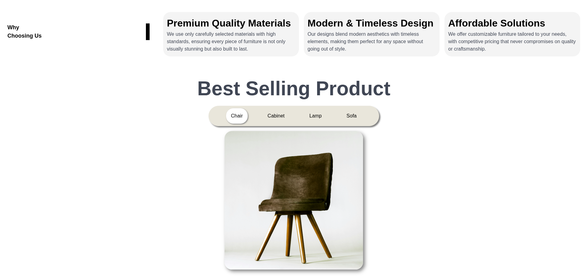

# 🪑 FURNIHOUSE  
**Interactive Furniture Landing Page**

FURNIHOUSE is a modern, interactive landing page built to showcase furniture products with a clean aesthetic and smooth user experience. Designed for minimalism lovers, this project blends elegant UI with lightweight performance.

---

## Features

-  **Modern & Minimal Design**  
  Clean layout with a focus on product presentation.

-  **Interactive UI Elements**  
  Hover effects, smooth transitions, and dynamic sections.

-  **Fast & Lightweight**  
  Built with pure HTML, CSS, and JavaScript (no heavy frameworks).

-  **Responsive Design**  
  Optimized for desktop, tablet, and mobile devices.

-  **Custom Styling**  
  Fully handcrafted CSS (with optional helper frameworks like Bulma).

---

## 🧱 Tech Stack

- HTML5  
- CSS3  
- Vanilla JavaScript  
- *(Optional)* Bulma (for layout helpers)

---

## 📸 Preview

A sleek landing page showcasing furniture collections with a modern touch.




<style>
    img{
        width: 60%;
    }
</style>

---

## 🚀 Getting Started

Clone the project:

```bash
git clone https://github.com/zzckyy/furnitureWebUI.git